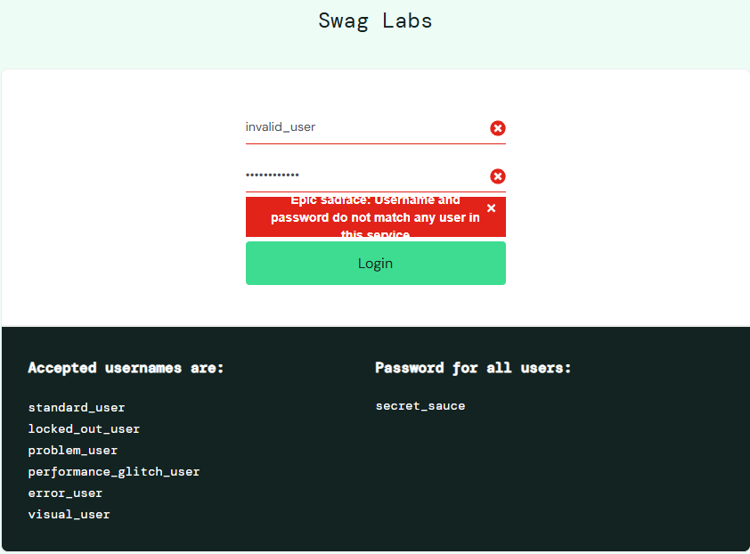
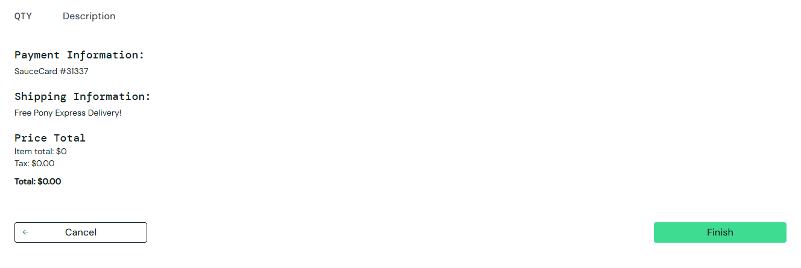
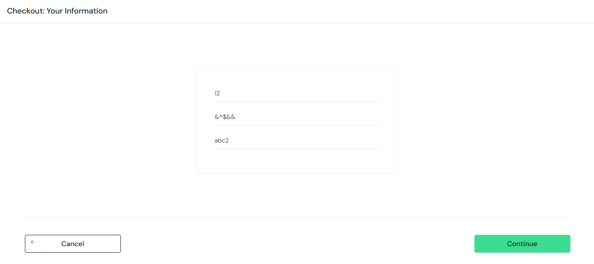
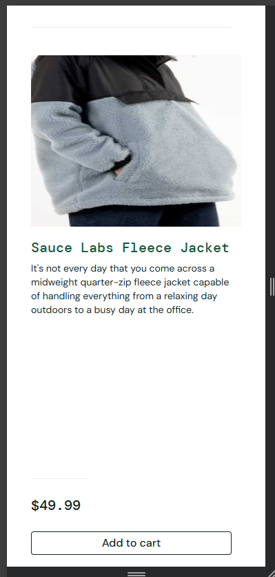

# Plano de Testes - Sauce Demo E-commerce

## 1. Introdução

O objetivo deste documento é descrever o plano de testes realizado para a plataforma de e-commerce **Sauce Demo** (https://www.saucedemo.com). O teste abrange os principais fluxos da aplicação, como login, navegação, compra, e funcionalidades relacionadas ao carrinho e checkout.

## 2. Casos de Teste

### 2.1 Login com Diferentes Tipos de Usuários

- **Objetivo**: Verificar se os usuários conseguem fazer login com diferentes tipos de credenciais.
- **Passos**:
  1. Acessar o site.
  2. Inserir as credenciais de login (usuário padrão e inválido).
  3. Verificar se o usuário é redirecionado para a página principal após login com credenciais válidas.
  4. Verificar se uma mensagem de erro é exibida ao tentar fazer login com credenciais inválidas.
- **Resultado Esperado**:
  - Login bem-sucedido redireciona para a página principal.
  - Login com erro exibe mensagem de erro.

### 2.2 Ordenação e Filtragem de Produtos

- **Objetivo**: Testar as funcionalidades de ordenação e filtragem de produtos.
- **Passos**:
  1. Acessar a lista de produtos.
  2. Ordenar os produtos por preço (crescente e decrescente).
  3. Filtrar produtos por categoria.
  4. Verificar se os produtos são apresentados corretamente.
- **Resultado Esperado**:
  - A ordenação e filtragem devem refletir as escolhas do usuário.

### 2.3 Fluxo Completo de Compra

- **Objetivo**: Verificar se o fluxo de compra está funcionando corretamente.
- **Passos**:
  1. Selecionar um produto e adicionar ao carrinho.
  2. Acessar o carrinho e verificar se o produto está presente.
  3. Realizar as etapas de adiçao de dados e finalizar a compra.
  4. Verificar se o pedido é registrado corretamente.
- **Resultado Esperado**:
  - O produto é adicionado ao carrinho e a compra é finalizada com sucesso.

### 2.4 Remoção de Itens do Carrinho

- **Objetivo**: Verificar se o sistema permite remover itens do carrinho corretamente.
- **Passos**:
  1. Adicionar um ou mais produtos ao carrinho.
  2. Remover um item do carrinho.
  3. Verificar se o item foi removido.
- **Resultado Esperado**:
  - O item é removido corretamente e o carrinho é atualizado.

### 2.5 Navegação entre Páginas

- **Objetivo**: Testar a navegação entre as diferentes páginas da plataforma.
- **Passos**:
  1. Acessar a página inicial.
  2. Navegar para diferentes páginas, como "Produtos", "Carrinho", "Login", "Checkout".
  3. Verificar se as páginas são carregadas corretamente.
- **Resultado Esperado**:
  - Todas as páginas devem carregar corretamente sem erros.

### 2.6 Logout

- **Objetivo**: Verificar se o logout funciona corretamente.
- **Passos**:
  1. Realizar o login com credenciais válidas.
  2. Clicar na opção de logout.
  3. Verificar se o usuário é redirecionado para a página de login.
- **Resultado Esperado**:
  - O usuário é deslogado corretamente e redirecionado para a página de login.

### 2.7 Títulos e descrições

- **Objetivo**: Validar a exibição, formatação e conteúdo dos títulos e descrições das páginas do site.
- **Passos**:
  1. Identificar os títulos principais e suas descrições associadas.
  2. Validar se os textos dos títulos e descrições estão corretos, claros e alinhados ao propósito da página.
  3. Verificar a consistência da formatação visual, como tamanho, fonte e alinhamento.
- **Resultado Esperado**: Os títulos e descrições devem estar corretamente exibidos, com formatação uniforme e conteúdo adequado para cada página.

### 2.8 Logos e Imagens

- **Objetivo**: Validar a presença e exibição correta do logo e outras imagens no site.
- **Passos**:
  1. Acessar as páginas principais.
  2. Verificar a presença do logo e das imagens nos locais designados.
  3. Validar se as imagens estão carregando corretamente e sem distorções.
- **Resultado Esperado**: Todas as imagens devem ser exibidas corretamente e estar relacionadas ao conteúdo da página.

### 2.9 Header e Footer

- **Objetivo**: Verificar a presença e funcionamento adequado dos elementos do header e footer.
- **Passos**:
  1. Acessar as páginas principais do site.
  2. Verificar se o header e footer estão presentes em todas as páginas.
  3. Testar os links e funcionalidades desses elementos.
- **Resultado Esperado**: O header e footer devem ser exibidos corretamente em todas as páginas, e os links/funções devem funcionar conforme esperado.

### 2.10 Menu

- **Objetivo**: Validar se o menu está presente na página e se seu conteúdo está correto.
- **Passos**:
  1. Acessar as páginas com menu.
  2. Verificar a presença e exibição do menu.
  3. Validar o conteúdo dos itens do menu e sua navegabilidade.
- **Resultado Esperado**: O menu deve exibir todos os itens corretamente e permitir a navegação esperada.

### 2.11 Ícones

- **Objetivo**: Verificar a exibição e funcionamento adequado de ícones em diferentes partes do site.
- **Passos**:
  1. Identificar todos os ícones exibidos nas páginas.
  2. Validar se os ícones são exibidos corretamente.
  3. Testar as ações associadas aos ícones.
- **Resultado Esperado**: Todos os ícones devem ser exibidos corretamente e funcionar conforme esperado.

## 3. Resultados dos Testes Executados

### 3.1 Resultados de Login

#### Login com Credenciais Válidas:

- **Credenciais**: Username: standard_user, Password: secret_sauce
- **Resultado Esperado**: O usuário é redirecionado para a página de produtos.
- **Resultado Obtido**: Passou. O usuário foi redirecionado corretamente para a página principal de produtos, onde todos são listados corretamente

#### Login com Credenciais Inválidas:

- **Credenciais**: Username: invalid_user, Password: invalid_password
- **Resultado Esperado**: O sistema exibe uma mensagem de erro.
- **Resultado Obtido**: Passou, mas com falha de UX/UI. Uma mensagem de erro foi exibida corretamente: "Epic sadface: Username and password do not match any user in this service".
- **Bug Reportado**: Problema de UX/UI. A mensagem de erro está cortada devido ao container de erro (error-message-container) ter uma altura fixa insuficiente para acomodar o texto completo. Isso pode afetar a experiência do usuário, dificultando a leitura do erro.
- **Sugestões na correção**: Ajuste na Altura do Container: O estilo do container de erro deve ser modificado para garantir que a altura seja automática (height: auto) ou que tenha uma altura mínima maior (ex: min-height: 50px) para garantir que a mensagem seja visualizada completamente.

#### Login com Usuário Bloqueado:

- **Credenciais**: Username: locked_out_user, Password: secret_sauce
- **Resultado Esperado**: O sistema exibe uma mensagem indicando que a conta está bloqueada.
- **Resultado Obtido**: Passou. A mensagem "Epic sadface: Sorry, this user has been locked out." foi exibida corretamente.

#### Login com Usuário de Problema (Problem User):

- **Credenciais**: Username: problem_user, Password: secret_sauce
- **Resultado Esperado**: O usuário consegue fazer login com sucesso e é redirecionado para a página de produtos. O problema com o usuário pode ser refletido no comportamento visual.
- **Resultado Obtido**: Passou, mas houve problemas visuais na página de produtos: todas as imagens dos produtos estavam incorretas (mesma imagem para produtos diferentes), o que impacta a experiência do usuário.

#### Login com Usuário de Glitch de Performance (Performance Glitch User)

- **Credenciais**: Username: performance_glitch_user, Password: secret_sauce
- **Resultado Esperado**: O usuário consegue fazer login com sucesso, mas pode perceber um pequeno atraso ou uma falha visual devido ao "glitch" de performance.
- **Resultado Obtido**: Passou. O login foi bem-sucedido, mas foi notado um atraso ou falha temporária na interface, conforme o esperado devido ao "glitch".

#### Login com Usuário com Erro (Error User)

- **Credenciais**: Username: error_user, Password: secret_sauce
- **Resultado Esperado**: O sistema exibe uma mensagem de erro, pois o usuário não está registrado ou suas credenciais são inválidas.
- **Resultado Obtido**: Falhou. O usuário conseguiu fazer login normalmente, sem nenhuma mensagem de erro, e foi redirecionado para a página de produtos, apesar de as credenciais serem inválidas. Não houve demora ou problemas visuais.
- **Bug Encontrado**: O sistema permitiu o login com credenciais inválidas, o que é um comportamento incorreto. O correto seria exibir uma mensagem de erro indicando que o usuário não foi autenticado.
- **Sugestões de Correção**: Garantir que o sistema valide corretamente as credenciais de login e exiba uma mensagem de erro adequada em caso de falha na autenticação.

### Login com Usuário Visual

- **Credenciais**: Username: visual_user, Password: secret_sauce
- **Resultado Esperado**: O login deve ser bem-sucedido, mas na interface visual podem haver erros.
- **Resultado Obtido**: Passou. O login foi bem-sucedido, mas há erros visuais aparentes, há imagens que não correspondem ao título dos produtos sendo vendidos, como esperado.

### 3.2 Resultados de Ordenação e Filtragem

- **Ordenação por ordem alfabética (A-Z)**: Passou
- **Ordenação por ordem alfabética (Z-A)**: Passou
- **Filtragem por preço (mais alto - mais baixo)**: Passou
- **Filtragem por preço (mais baixo - mais alto)**: Passou

### 3.3 Resultados do Fluxo Completo de Compra

- **Adição de produto ao carrinho**: Passou. Ao clicar no botão de adicionar, o produto é corretamente enviado para o carrinho, e o número no ícone do carrinho é incrementado, indicando a inclusão do item. No entanto, foi observado que atualmente só é possível adicionar uma unidade de cada produto ao carrinho, sem a opção de aumentar a quantidade de unidades do mesmo item diretamente. Isso pode limitar a experiência do usuário caso ele deseje comprar várias unidades de um mesmo produto.
  **Sugestão de melhoria**: Implementar uma funcionalidade que permita o ajuste da quantidade de unidades de cada produto diretamente no carrinho, com botões ou campos de incremento/decremento.
- **Finalização da compra**: Falhou. Apesar de o sistema funcionar normalmente ao finalizar uma compra com produtos no carrinho, foi identificado que o sistema permite realizar o checkout mesmo sem nenhum produto no carrinho, seguindo todo o fluxo de compra até a confirmação final. Além disso, Ao clicar no botão de checkout, o usuário é redirecionado para a página "Checkout: Your Information", onde deve preencher seus dados em três campos: primeiro nome (first name), sobrenome (last name) e código postal (zip/postal code), o sistema atualmente permite que os campos "first name" e "last name" sejam preenchidos com qualquer caractere, inclusive números e símbolos, o que não deveria ser o caso. O campo "postal code" também aceita caracteres não numéricos, o que é um erro, já que o código postal deveria aceitar apenas números.
  **Observação**: Durante o checkout com o carrinho vazio, as informações exibidas na descrição de compra incluem: Item total: $0; Tax: $0; Total: $0.00. Esse comportamento gera uma inconsistência, permitindo a confirmação de compras inválidas.
  **Impacto**: Esse comportamento pode gerar confusão para o usuário e permitir pedidos inválidos ou inconsistentes no sistema.
  **Sugestão de correção**: Adicionar uma validação no fluxo de checkout que impeça a continuidade do processo caso o carrinho esteja vazio, exibindo uma mensagem de erro apropriada como "Adicione produtos ao carrinho antes de continuar". Implementar validações rigorosas para garantir que "first name" e "last name" aceitem apenas strings de caracteres alfabéticos e que o "postal code" aceite apenas números. Caso algum dos campos não seja preenchido corretamente, o sistema deve exibir uma mensagem de erro clara e impedir a continuidade do checkout até que as correções sejam feitas.

### 3.4 Resultados de Remoção de Itens do Carrinho

- **Remoção de item**: Passou. Ao clicar no botão de remover, o produto é corretamente excluído da lista do carrinho, e o número exibido no ícone do carrinho é atualizado para refletir a nova quantidade de itens. O sistema responde de forma eficiente, garantindo que a lista do carrinho seja sincronizada com as ações do usuário.

### 3.5 Resultados de Navegação

- **Navegação entre páginas**: Passou. Todas as páginas carregam corretamente sem erros.

### 3.6 Resultados de Logout

- **Logout bem-sucedido**: Passou. Logout realizado com sucesso em todas as sessões de login.

### 3.7 Títulos e descrições

- **Resultado da Verificação**: Passou. Todos os títulos e descrições foram validados e estão corretos.
- **Sugestões de Melhoria**: Adicionar informações técnicas, como materiais, tamanhos ou instruções de uso onde aplicável, para facilitar a tomada de decisão dos consumidores.

### 3.8 Logos e Imagens

- **Resultado da Verificação**: Passou. Durante o teste, foi validado que todas as imagens exibidas correspondem corretamente aos produtos descritos em seus respectivos títulos e descrições quando logado com credenciais válidas.
- **Sugestão de melhoria**: Implementar um logo oficial para a marca no site, fortalecendo a identidade visual. Atualmente, a única representação visual da marca é o ícone da aba do navegador, que não aparece em nenhuma área visível da interface. A inclusão de um logo pode melhorar o reconhecimento da marca e a experiência do usuário.

### 3.9 Header e Footer

- **Resultado da Verificação**: Passou parcialmente. No header, a estrutura é simples e funcional. No footer, todos os ícones redirecionam para os links corretos, indicando que as funcionalidades estão implementadas corretamente. No entanto, ao clicar no link "Privacy Policy" dentro do texto:
  "© 2024 Sauce Labs. All Rights Reserved. Terms of Service | Privacy Policy", nenhuma ação ocorre, e as políticas de privacidade não são exibidas.
- **Sugestão de melhoria**: Corrigir o link "Privacy Policy" para que redirecione ao documento ou página apropriada com as políticas de privacidade da marca. Considerar adicionar informações ou links úteis no footer para aprimorar a experiência do usuário, como detalhes de contato ou FAQs.

### 3.10 Menu

- **Resultado da Verificação**: Passou.
- **Sugestão de melhoria**: Considerar incluir ícones ou descrições adicionais ao lado dos itens para melhorar a experiência do usuário e tornar o menu mais intuitivo.

### 3.11 Ícones

- **Resultado da Verificação**: Passou.

## 4. Sugestões de Melhoria de UX/UI

- **Melhoria 1**:
- **Melhoria 2**:
- **Melhoria 3**:

## 5. Lista de Bugs Encontrados

### Bug 1: Mensagem de Erro Cortada no Login

- **Descrição**: A mensagem de erro exibida ao tentar logar com credenciais inválidas está sendo cortada.
- **Passos para Reproduzir**:
  1. Acesse a página de login.
  2. Insira as credenciais inválidas: Username: invalid_user, Password: invalid_password.
  3. Clique no botão "Login".
- **Resultado Esperado**: A mensagem de erro completa é exibida.
- **Resultado Obtido**: A mensagem de erro está cortada, dificultando a leitura.
- **Sugestões de Correção**: Aumentar a altura do `error-message-container` para garantir que a mensagem seja completamente visível.
  

  ### Bug 2: Login com Credenciais Inválidas (Error User)

- **Descrição**: O sistema permitiu o login com credenciais inválidas, o que não deveria ocorrer.
- **Passos para Reproduzir**:
  1. Acesse a página de login.
  2. Insira as credenciais inválidas: Username: error_user, Password: secret_sauce.
  3. Clique no botão "Login".
- **Resultado Esperado**: O sistema deve exibir uma mensagem de erro informando que as credenciais estão incorretas.
- **Resultado Obtido**: O usuário foi autenticado e redirecionado para a página de produtos, apesar das credenciais inválidas.
- **Sugestões de Correção**: Garantir que o sistema valide corretamente as credenciais de login e exiba uma mensagem de erro adequada quando necessário.

### Bug 3: Checkout Permitido com Carrinho Vazio

- **Descrição**: O sistema permite realizar o checkout mesmo sem nenhum produto no carrinho.
- **Passos para Reproduzir**:
  1. Acesse o site e faça login.
  2. Navegue para o carrinho sem adicionar nenhum produto.
  3. Clique em "Checkout".
  4. Siga todo o fluxo até a confirmação final.
- **Resultado Esperado**: O sistema deveria exibir uma mensagem de erro informando que o carrinho está vazio, impedindo o checkout.
- **Resultado Obtido**: O checkout é realizado normalmente, exibindo as informações de compra com valores zerados:
  **Item total**: $0
  **Tax**: $0
  **Total**: $0.00
- **Sugestões de Correção**: Adicionar uma validação no fluxo de checkout para impedir a continuidade do processo caso o carrinho esteja vazio. Exibir uma mensagem de erro como "Adicione produtos ao carrinho antes de continuar".
  

### Bug 4: Validação de Campos no Checkout (First Name, Last Name e Postal Code)

- **Descrição**: O sistema permite que os campos "First Name" e "Last Name" aceitem números e símbolos, e o campo "Postal Code" aceita caracteres não numéricos.
- **Passos para Reproduzir**:

1. Acesse a página de "Checkout: Your Information".
2. No campo "First Name", insira um valor como "John123" ou "John$#".
3. No campo "Last Name", insira um valor como "Doe456" ou "Doe@!".
4. No campo "Postal Code", insira um valor como "123AB" ou "ABCDE".
5. Clique em "Continue" para prosseguir.

- **Resultado Esperado**: O sistema deve aceitar apenas caracteres alfabéticos nos campos "First Name" e "Last Name" e apenas números no campo "Postal Code".
- **Resultado Obtido**: O sistema permite a inserção de caracteres não permitidos nos campos de nome e código postal, permitindo a continuidade do checkout.
- **Sugestões de Correção**: Implementar validações rigorosas para os campos:
  **First Name e Last Name**: Aceitar apenas letras e espaços (regex: /^[A-Za-z\s]+$/).
  **Postal Code**: Aceitar apenas números, com o formato esperado "xxxxx" ou "xxxxx-xxx". Exibir mensagens de erro apropriadas quando os campos forem preenchidos incorretamente.
- **Sugestão Adicional**: Considerar a adição de uma máscara de entrada para o campo Postal Code, para garantir que os usuários insiram o código postal no formato correto, como "xxxxx" ou "xxxxx-xxx". Isso pode melhorar a experiência do usuário e evitar erros de formatação.
  

### Bug 5: Problema de Responsividade em Smartphone

- **Descrição**: A aplicação apresenta problemas de layout em dispositivos com resolução de 375x667 e 375x812. As imagens ficam ligeiramente distorcidas e o valor do produto fica com um espaçamento excessivo em relação ao produto.
- **Passos para Reproduzir**:

1. Acesse a página principal da aplicação.
2. Ajuste a resolução para Smartphone (375x667, 375x812).
3. Observe o layout da página, especialmente nas áreas de imagem e preço.

- **Resultado Esperado**: As imagens devem se ajustar corretamente à tela e o valor do produto deve estar posicionado adequadamente em relação ao produto, sem espaçamento excessivo.
- **Resultado Obtido**: As imagens apresentam distorção e o valor do produto fica com um grande espaçamento do produto, comprometendo a experiência do usuário.
- **Sugestões de Correção**: Ajustar as proporções das imagens para que se ajustem corretamente em diferentes tamanhos de tela. Verificar o comportamento do layout e ajustar o espaçamento entre os elementos, garantindo que o valor do produto fique corretamente alinhado ao produto.
  

## 6. Análise de Riscos

- **Risco de Usabilidade**: Alguns fluxos de navegação podem ser confusos ou difíceis de usar, como a interface do login, que apresenta falhas de UX/UI (como a altura fixa do container de erro). Isso pode impactar a experiência do usuário, principalmente em dispositivos móveis.
- **Risco de Funcionalidade**: A possibilidade de um usuário completar o checkout mesmo sem ter adicionado produtos ao carrinho é um risco grave, pois pode gerar pedidos inválidos e inconsistentes.
- **Risco de Performance**: A lentidão observada em alguns fluxos, como o login e a navegação, pode impactar a experiência do usuário, principalmente em conexões mais lentas ou dispositivos menos potentes.
- **Risco de Validação de Campos**: A falta de validação rigorosa nos campos de "first name", "last name" e "postal code" durante o checkout pode permitir entradas incorretas, resultando em erros de processamento ou falhas no sistema.

### 6.1 Estratégias de Mitigação

- Melhoria da UX/UI: Ajustar a altura do container de erro para garantir que as mensagens sejam visíveis corretamente. Melhorar os fluxos de navegação com foco em usabilidade.

- Revisão do Fluxo de Checkout: Implementar validações que restrinjam a finalização da compra quando o carrinho estiver vazio. Assegurar que os campos de dados pessoais sejam preenchidos corretamente antes de permitir a continuidade.

- Validação de Campos: Garantir que todos os campos no fluxo de checkout (e outras entradas de dados) sejam validados corretamente, aceitando apenas valores válidos e fornecendo mensagens de erro claras e concisas.

## 7. Testes Extras

### 7.1 Testes de Responsividade

# Testes de Layout e Design:

Verificar se a aplicação mantém sua estrutura visual e funcionalidade em diferentes tamanhos de tela. Testar os fluxos principais (login, compra, checkout) em resoluções de dispositivos Desktop, Tablet e Smartphone.

**Desktop (1366x768, 1920x1080)**: Passou.
**Tablet (768x1024, 800x1280)**: Passou.
**Smartphone (375x667, 375x812)**: Falhou. As imagens apresentam leve distorção e o valor do produto fica com um espaçamento muito grande em relação ao produto.

### 7.2 Sugestões de Automação

- Automatizar o fluxo de login, compra e remoção de itens do carrinho.
- Implementar testes automatizados para validação de navegação entre páginas e ordenação de produtos.
